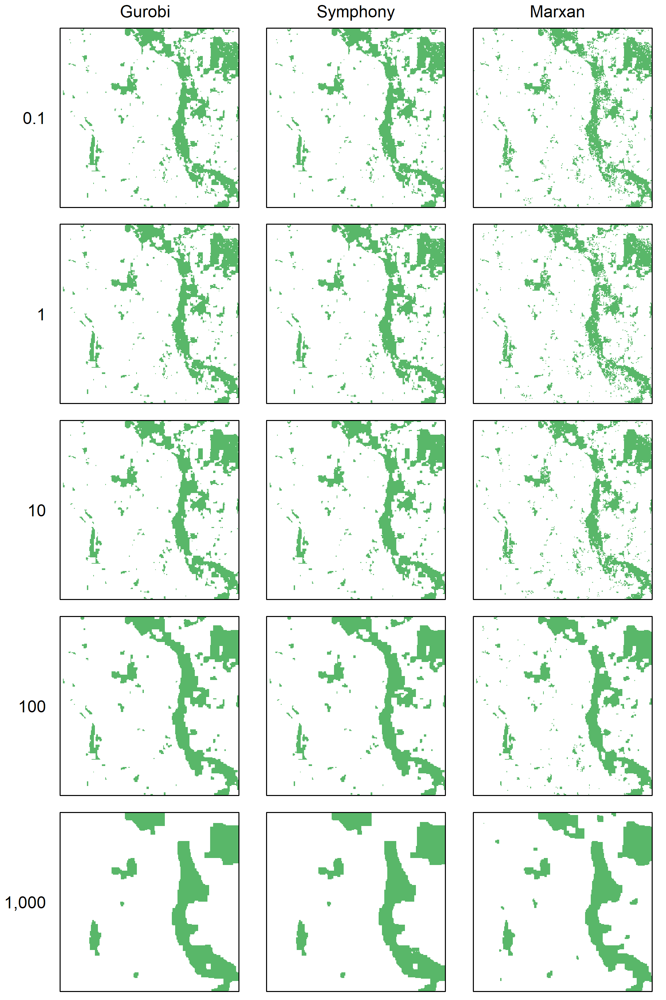

\captionsetup[table]{labelformat=empty}


```{r setup, include=FALSE}
knitr::opts_chunk$set(echo = TRUE)

library(raster)
library(foreach)
library(doParallel)
library(uuid)
library(here)
library(tidyverse)
library(prioritizr)
library(sf)
library(RColorBrewer)

pkg_list <- c("raster", "prioritizr", "marxan", "uuid",  "here", "tidyverse")
select <- dplyr::select
walk(list.files("R", full.names = TRUE), source)
prioritizr_timed <- add_timer(prioritizr::solve)


spp <- read_csv(here("data", "nplcc_species.csv"))
names(spp)[-1] <- c("Species Code", "Common Name", "Scientific Name")
# Post-processing
runs_long <- read_csv(here("output", "ilp-comparison-runs.csv"))
runs_long <- runs_long %>% mutate(solv_it = ifelse(!is.na(marxan_iterations), paste(solver, marxan_iterations, sep="_"), solver)) %>%
  filter(run_id < 200)

runs_gur <- runs_long %>% filter(solver == 'gurobi') %>% mutate(cost_gur = cost, time_gur = time) %>% select(run_id, cost_gur, time_gur)

runs_long <- inner_join(runs_long, runs_gur, by = "run_id")


rl_filt <- runs_long %>% filter(n_features == 72 & n_pu == 148510 & 
                                  (solver != 'marxan' | (marxan_iterations > 1E+07 & spf > 1))
) %>% group_by(solver, target) %>% 
  summarise(time = mean(time, na.rm = T),
            cost = mean(cost, na.rm = T),
            time_gur = mean(time_gur, na.rm = T),
            cost_gur = mean(cost_gur, na.rm = T))

rl_filt <- rl_filt %>%
  mutate(deltaC = (cost - cost_gur)/cost_gur * 100,
         deltaT = cost - cost_gur,
         deltaTM = (time - time_gur)/time_gur * 100,
         deltaTT = time - time_gur
  )


pp <- function(x, title = "", y.var, xlab = "", ylab = "") {
  #x.var <- enquo(x.var)
  y.var <- enquo(y.var)
  ggplot(x, 
         aes(x = target * 100, y = !! y.var, colour = as.factor(n_pu) , shape = as.factor(n_features), 
             group = interaction(n_features, n_pu))) +
    scale_colour_discrete(name  ="Planning units") +
    scale_shape_discrete(name  ="Features") + 
    xlab(xlab) + 
    ylab(ylab) + 
    geom_line() +
    geom_point() + 
    ggtitle(title) +
    theme_bw()
}

runs_red <- runs_long %>% filter(run_id <200)

rr_marxan_compl <- runs_red %>% filter(solver == "gurobi" | solver == "rsymphony" | (solver == "marxan" & n_solutions == 10))
rr_marxan_compl <- rr_marxan_compl %>% group_by(solver)

rr_marxan_compl <- rr_marxan_compl %>% mutate(time_perc = (time - time_gur)/time_gur * 100,
                    cost_perc = (cost - cost_gur)/cost_gur *100)


CA_land <- readRDS("data/gadm36_CAN_1_sf.rds")
CA_land_red <- CA_land %>% filter(NAME_1 == "British Columbia")

US_land <- readRDS("data/gadm36_USA_1_sf.rds")
US_land_red <- US_land %>% filter(NAME_1 == "Washington" | NAME_1 == "Oregon")

ne_land <- rbind(CA_land_red, US_land_red) %>% st_geometry()
ne_lines <- st_cast(ne_land, "MULTILINESTRING")

study_area <- raster("data/study_area.tif")
 
crs <- crs(study_area)

e <- extent(study_area)
text_col <- "black"

# prepare vector layers
land <- st_transform(ne_land, crs = crs)
plot_line <- st_transform(ne_lines, crs = crs)


```


Supporting Information for 

#### Integer Linear programming outperforms simulated annealing for solving conservation planning problems 
  
Richard Schuster, Jeffrey O. Hanson, Matt Strimas-Mackey, Joseph R. Bennett 

\newpage
## Appendix S2

### Marxan Terminology

Description of some terms used in Marxan analysis. Text marginally modified from the Marxan Manual (v1.8.2): Ball, I. R., & Possingham, H. P. (2000). MARXAN (V1. 8.2). Marine Reserve Design Using Spatially Explicit Annealing, a Manual.

#### Calibration

The objective of calibration is to ensure that the set of solutions Marxan produces are close to the “lowest cost” or optimum. Common user settings to explore in calibration are setting the 'Species Penalty Factor', 'Number of Iterations', and 'Boundary Length Modifier'. Those user settings, however, can have a large impact on solution efficiency (Fischer and Church, 2005). 

Fischer, D. T., & Church, R. L. (2005). The SITES reserve selection system: a critical review. Environmental Modeling & Assessment, 10(3), 215-228.

#### Species Penalty Functions

The Penalty component of the Marxan objective function is the penalty given to a reserve system for not adequately representing conservation features. It is based on the principle that if a conservation feature is below its target representation level, then the penalty should be an approximation of the cost of raising that conservation feature up to its target representation level.

#### Number of Iterations

The number of iterations set has a substantial bearing on how long each run takes. In general, the number of iterations determines how close Marxan gets to the optimal solution (or at least a very good solution). The number should start high (e.g. 1000000) and then be increased (e.g. 10 million or more is commonly applied on large scale datasets) until there is no substantial improvement in score as iterations continues to increase. At some point, the extra time required by a higher number of iterations will be better spent doing more runs than spending a long time on each run.  Choose an acceptable trade-off between solution efficiency (score, or number of planning units) and execution time (number of iterations).

#### Boundary Length Modifiers

The variable, ‘BLM’ (Boundary Length Modifier), is used to determine how much emphasis should be placed on minimising the overall reserve system boundary length. Minimising this length will produce a more compact reserve system, which may be desirable for a variety of pragmatic reasons. Emphasising the importance of a compact network will mean that your targets are likely to be met in a smaller number of large reserves, generally resulting in an overall larger and more expensive reserve system. Thus, the BLM works counter to the other major goal of Marxan, to minimise the overall cost of the solution. BLM can be thought of as a relative sliding scale, ranging from cheaper fragmented solutions (low BLM) to a more compact expensive ones (high BLM). Because this will have a large influence on the final solutions, some work is needed to ensure an appropriate value (or range of values) is found. 


\newpage
## Table S1
```{r TableS1, echo = FALSE, message = FALSE, results = "asis"}
knitr::kable(spp[,-1], caption = "**Table S1**: List of species that were used as features in our analysis.")
```

\newpage

## Figure S1
```{r FigS1, echo = FALSE}
par(mar = c(0.1, 0.1, 0.1, 0.1), oma = c(0,0,0,0), bg = "light blue")
plot(land, col = "grey85", border = NA, xlim = e[1:2], ylim = e[3:4])

plot(study_area, add = TRUE, col = "green4", legend = FALSE, 
     maxpixels = ncell(study_area))

# boundaries
plot(plot_line, col = "black", lwd = 1, add = TRUE)
# plot(state, col = "black", lwd = 0.5, lty = 1, add = TRUE)
# plot(country, col = "black", lwd = 1, add = TRUE)

# title
# plot bounds
usr <- par("usr")
xwidth <- usr[2] - usr[1]
yheight <- usr[4] - usr[3]
# labels

# text(x = usr[1] + 0.6 * xwidth, y = usr[3] + 0.2 * yheight,
#      labels = "Study area", pos = 4, font = 1, cex = 1.2, col = text_col)

text(x = usr[1] + 0.75 * xwidth, y = usr[3] + 0.9 * yheight,
     labels = "British Columbia", pos = 4, font = 1, cex = 1.2, col = text_col)

text(x = usr[1] + 0.75 * xwidth, y = usr[3] + 0.4 * yheight,
     labels = "Washington", pos = 4, font = 1, cex = 1.2, col = text_col)

text(x = usr[1] + 0.75 * xwidth, y = usr[3] + 0.08 * yheight,
     labels = "Oregon", pos = 4, font = 1, cex = 1.2, col = text_col)


```
**Figure S1**: Study area. 

\newpage
## Figure S2
```{r FigS2, echo = FALSE}
pp(rr_marxan_compl %>% filter(solver == "marxan" & marxan_iterations > 1E+07 & spf > 1 & spf < 125), "", cost_perc,
   xlab = "Target [%]", ylab = "Cost increase using SA compared to ILP [%]")
```
**Figure S2**: Percent cost increase of SA solutions compared to ILP solutions, across targets, number of features and number of planning units. Simulated annealing (i.e. Marxan) parameters used are: number of iterations > 100,000; species penalty factor 5 or 25. Not all Marxan scenarios generated yielded feasible solutions (where all targets were met), which is why e.g. there is only one observation for 37,128 planning units and 10 features.

\newpage
## Figure S3
```{r FigS3, echo = FALSE}
pp(rr_marxan_compl %>% filter(solver == "gurobi"), "", cost,
   xlab = "Target [%]", ylab = "Solution cost [$]")
```
**Figure S3**: Cost profile for Gurobi solver across targets, number of features and number of planning units.

\newpage
## Figure S4
```{r FigS4, echo = FALSE}
pp(rr_marxan_compl %>% filter(solver == "rsymphony"), "", cost,
   xlab = "Target [%]", ylab = "Solution cost [$]")
```
**Figure S4**: Cost profile for SYMPHONY solver across targets, number of features and number of planning units.

\newpage
## Figure S5
```{r FigS5, echo = FALSE}
pp(rr_marxan_compl %>% filter(solver == "marxan") %>% group_by(target, n_features, n_pu) %>% 
     summarise(cost = mean(cost)), "", cost,
   xlab = "Target [%]", ylab = "Solution cost [$]")
```
**Figure S5**: Cost profile for Marxan using Simulated Annealing across targets, number of features and number of planning units.

\newpage
## Figure S6
```{r FigS6, echo = FALSE}
pp(rr_marxan_compl %>% filter(solver == "rsymphony"), "", time_perc / 100,
   xlab = "Target [%]", ylab = "Multiplier for SYMPHONY to baseline time of Gurobi")
```
**Figure S6**: Time to solution comparisons between SYMPHONY and Gurobi across targets, number of features and number of planning units.

\newpage
## Figure S7
```{r FigS7, echo = FALSE}
pp(rr_marxan_compl %>% filter(solver == "marxan") %>% group_by(target, n_features, n_pu) %>% 
     summarise(time_perc = mean(time_perc)), "", time_perc / 100,
   xlab = "Target [%]", ylab = "Multiplier for Marxan to baseline time of Gurobi")
```
**Figure S7**: Time to solution comparisons between Marxan using Simulated Annealing and Gurobi across targets, number of features and number of planning units.

\newpage
## Figure S8
```{r FigS8, echo = FALSE}
pp(rr_marxan_compl %>% filter(solver == "gurobi"), "", time,
   xlab = "Target [%]", ylab = "Time to solution [seconds]")
```
**Figure S8**: Time to solution profile for Gurobi solver across targets, number of features and number of planning units.

\newpage
## Figure S9
```{r FigS9, echo = FALSE}
pp(rr_marxan_compl %>% filter(solver == "rsymphony"), "", time,
   xlab = "Target [%]", ylab = "Time to solution [seconds]")
```
**Figure S9**: Time to solution profile for SYMPHONY solver across targets, number of features and number of planning units.

\newpage
## Figure S10
```{r FigS10, echo = FALSE}
pp(rr_marxan_compl %>% filter(solver == "marxan") %>% group_by(target, n_features, n_pu) %>% 
     summarise(time = mean(time)), "", time,
   xlab = "Target [%]", ylab = "Time to solution [seconds]")
```
**Figure S10**: Time to solution profile for Marxan using Simulated Annealing across targets, number of features and number of planning units.

## Figure S11
```{r FigS11, echo = FALSE}

```
**Figure S11**: Compactness of solutions. Shown are the solutions for a 10% target. The numbers represent BLM values.


